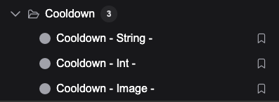
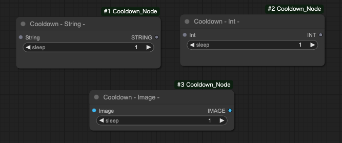

# ComfyUI Cooldown Node

The `ComfyUI Cooldown Node` provides custom nodes with a cooldown feature.

## Installation

Run this command in the `custom_nodes` directory:

```
git clone https://github.com/tuki0918/ComfyUI_Cooldown_Node
```

## Nodes




